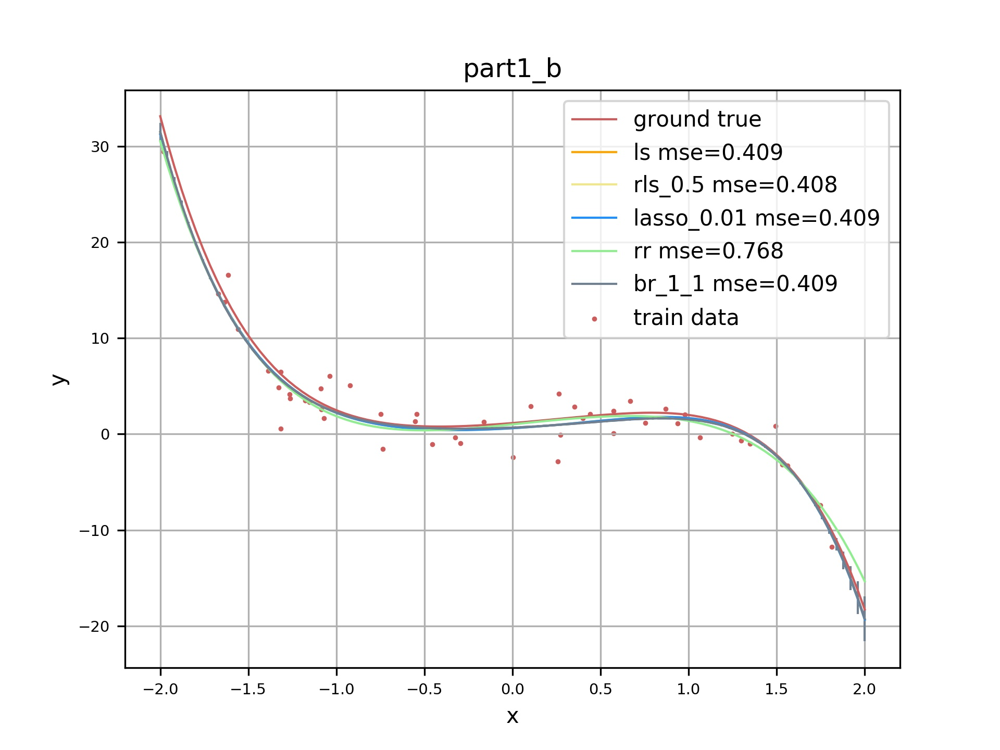
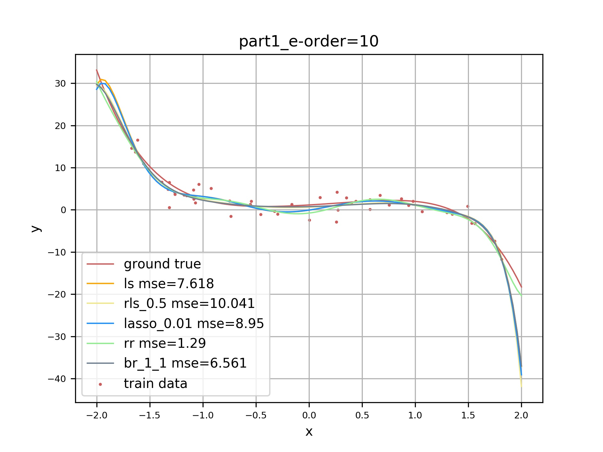
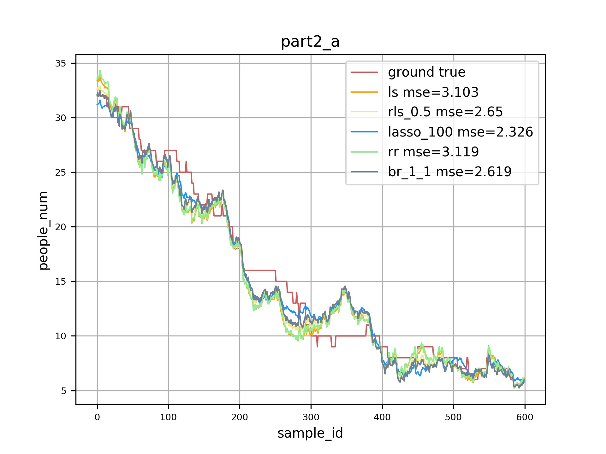
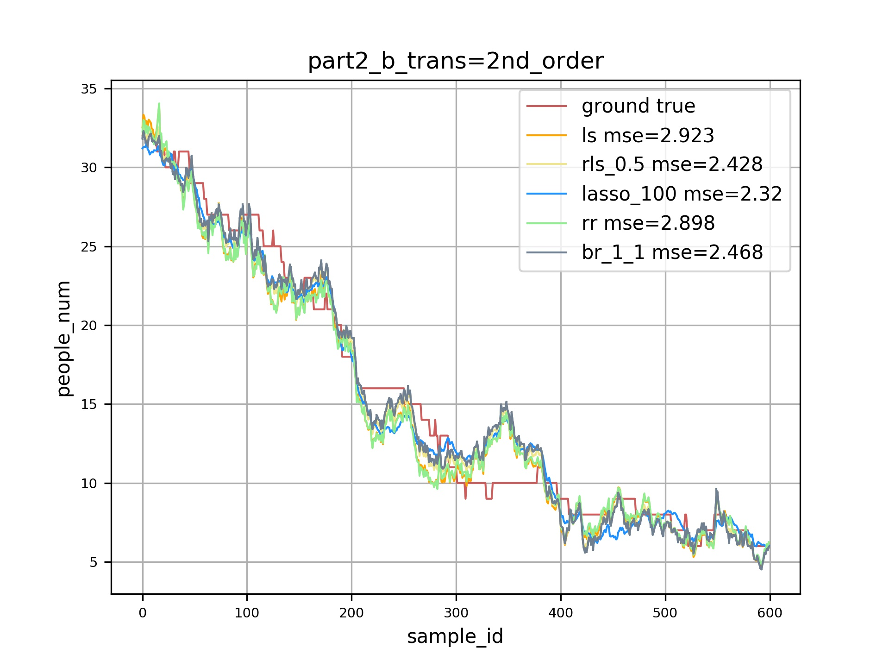

# PA1
PA1 for Machine Learning Course

**Requirement**
Just run code under develop environment, no more test for other envs. 
  - Ubuntu 16.04
  - Anaconda3 + Python3.5
  - Python package: 
      - numpy: for saving matrix
      - scipy: for load .mat file
      - cvxopt: for L1RegularizedLS and RobustRegression solution
      - matplotlib: draw curves
      - logging: record runtime log

**Structure of Project**
  - src: main source code. (algorithm, drawer and dataloader)
  - script: runable scripts
  - dataset: readable format of data
  - output:  path to save curves' images
  - canvas:  file from course website
 
 
**Step to Run**
  - Enter the root path of project.
  - Run **python -m script.script_name**.
  - Check ./output for results.

**Known Bug**
  - for **script.part1_c**, if use only 10% data for train, the RobustRegression will crash in cvxopt step. 
  
  
**Results**
  - part1_b

  - part1_c  

  - part1_d

  - part1_e

  - part2_a

  - part2_b

